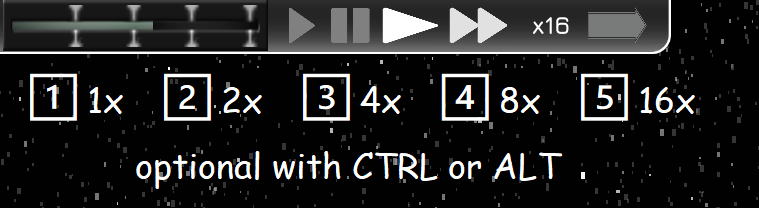

## Speed Hotkeys

This simple mod adds hotkeys for changing game speed instantly.
By default the number keys `1` - `5` are assigned to the normals speeds, this can be changed in the settings

## Caution
This uses the same keys as actions for selected items, use CTRL or ALT prefixes to prevent that or remap to your favorite keys.

There is an experimental mode which may be game breaking so use at own discretion.

## Installation / Usage
- Install the UnityModManager [from here](https://www.nexusmods.com/site/mods/21?tab=files)
- If it's the first time, select Ostranauts as the game and click Install, then
  - Download newest mod zip from Releases
  - *Install zip using ModManager*: open the Mods tab and drop the zip file at the bottom
  - or *Unzip manually* into the `Ostranauts_Data/Mods/SpeedHotkeys` folder
- In the game, press CTRL + F10 (Fn) for the ModMenu and adjust settings to your likings
- If you want to restore default functionality you can disable the mod in that ModMenu
- **BepInEx** (Install BepInEx), Extract mod DLL into `BepInEx/plugins` folder, INI config files will be generated on game start
- The [BepInEx ConfigurationManager](https://github.com/BepInEx/BepInEx.ConfigurationManager?tab=readme-ov-file#plugin--mod-configuration-manager-for-bepinex) is recommended for ingame settings changes.

## Preview

